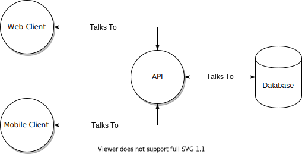
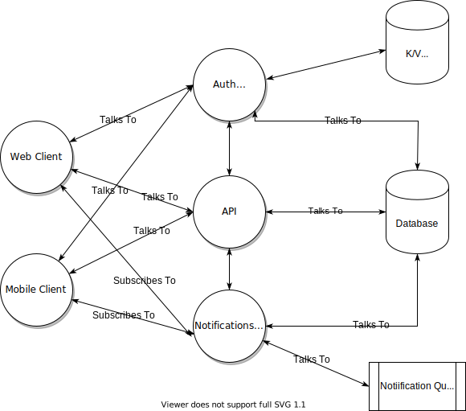
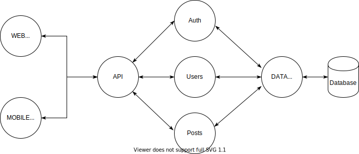
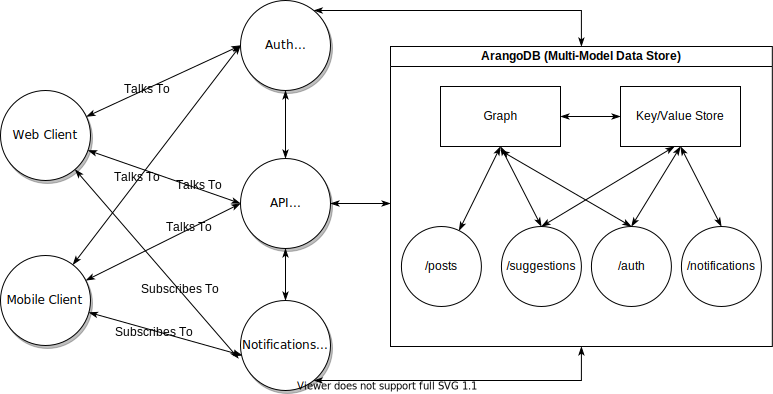

<!-- Global style -->

# TypeScript Powered DAL Microservcies

https://rasjonell.tech

---

# How am I

- Software Engineer @ [GRÜV](https://gruv.me/)
  - Graph Databases
  - Real-Time Systems
  - Recommendation/Suggestion Systems
- OSS maintainer @ [Squash](https://github.com/SquashConsulting)
- Contributing to OSS related to [ArangoDB](arangodb.com/), [Elixir](https://elixir-lang.org/), [Phoenix](https://phoenixframework.org/).

---

# What are we going to build

Short demo time!

---

## Bloated API Layer.

- Presentation Layer (JSON API).
- Business Logic Code.
- Database Domain Logic Code.

Problems:

- No separation of concerns.
- Unable to scale independently.

---

## Microservice Architecture.

- Separation of concerns.
- Ability to scale different areas independently.

Problems:

- Duplication of data domain logic.

---

## Separate Data Access Layer.

- Clear separation of concerns.
- Ability to scale BLL/DAL independently.
- No duplication of data domain logic.

Problems:

- Performance.
- Single point of failure.

---

## The Foxx Way

---

# Me on WWW

- [Blog](https://rasjonell.tech/)
- [Twitter](https://twitter.com/iRasjonell)
- [Mastodon](https://թութ.հայ/@gurgen)
- [Dev.to](https://dev.to/rasjonell)
