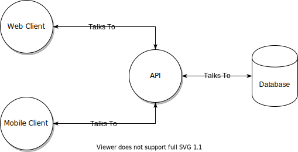

<!-- Global style -->
<style>
  h1 {
    color: #fff;
  }
  li {
    font-size: 32px;
  }
</style>


# TypeScript Powered DAL MicroServices

https://rasjonell.tech

---

# Who Am I?


- Software Engineer @ [GRÜV](https://gruv.me/)
  - Graph Databases
  - Real-Time Systems
  - Recommendation/Suggestion Systems
- OSS maintainer @ [Squash](https://github.com/SquashConsulting)
- Contributing to OSS related to [ArangoDB](arangodb.com/), [Elixir](https://elixir-lang.org/), [Phoenix](https://phoenixframework.org/).

---

# What Are We Going To Build?

<style>
  p {
    text-align: center;
  }
</style>


Social Media App

- Users can follow each other
- Create posts
- Rate posts
- Get basic recommendations
- Have multiple timelines
- Mute other users

---

<style scoped>
  section {
    display: flex;
    align-items: center;
    flex-direction: column;
    justify-content: center;
  }

  p {
    width: 100%;
    height: 100%;
  }

  img {
    width: 100%;
    height: 100%;
  }
</style>

## Monolith Design.



---

## Bloated API:

- Presentation Layer (JSON API).
- Business Logic Code.
- Database Domain Logic Code.

## Problems:

- No separation of concerns.
- Unable to scale independently.

---

<style scoped>
  section {
    display: flex;
    align-items: center;
    flex-direction: column;
    justify-content: center;
  }

  p {
    width: 100%;
    height: 100%;
  }

  img {
    width: 100%;
    height: 100%;
  }
</style>

## Microservice Architecture.


---

## Benefits:

- Separation of concerns.
- Ability to scale different areas independently.

## Problems:

- Data domain log inside the BLL.
- Duplication of data domain logic.

---

<style scoped>
  section {
    display: flex;
    align-items: center;
    flex-direction: column;
    justify-content: center;
  }

  p {
    width: 100%;
    height: 100%;
  }

  img {
    width: 100%;
    height: 100%;
  }
</style>

## Separate Data Access Layer.


---

## Benefits:

- Clear separation of concerns.
- Ability to scale BLL/DAL independently.
- No duplication of data domain logic.

## Problems:

- Performance.
- Network overhead.
- Single point of failure.

---

<style scoped>
  section {
    display: flex;
    align-items: center;
    flex-direction: column;
    justify-content: center;
  }

  p {
    width: 100%;
    height: 100%;
  }

  img {
    width: 100%;
    height: 100%;
  }
</style>

## Separate Data Access Layer (continued).


---

## The Foxx Way

<style scoped>
  section {
    display: flex;
    align-items: center;
    flex-direction: column;
    justify-content: center;
  }
  
  p {
    width: 100%;
  }

  img {
    width: 100%;
  }
</style>


---

# Foxx Services

> ArangoDB allows application developers to write their data access and domain logic as microservices running directly within the database with native access to in-memory data. The Foxx microservice framework makes it easy to extend ArangoDB’s own REST API with custom HTTP endpoints using modern JavaScript running on the same V8 engine you know from Node.js and the Google Chrome web browser.

---

<style scoped>
  section {
    display: flex;
    align-items: center;
    flex-direction: column;
    justify-content: center;
  }
</style>

# How Foxx Works

- Foxx services run embedded in ArangoDB.
- Each service is mounted in each available V8 context
- Incoming requests are distributed across these contexts automatically.

---

<style scoped>
  section {
    display: flex;
    align-items: center;
    flex-direction: column;
    justify-content: center;
  }
</style>

# Foxx ≠ Node.js

- **Foxx services are purely synchronous and blocking!**
- You should not perform long-running operations.
- You should avoid external operations that may affect the database performance.

---

<style scoped>
  section {
    padding-top: 15px;
  }

  code {
    fontSize: 18px;
  }
</style>

## Compatibility With NodeJS

NodeJS:

```js
const crypto = require('crypto');
const hash = crypto
  .createHash('sha512')
  .update('password')
  .digest('hex');
console.log(hash); // 109f3bbbc244eb82441917ed06d618b9008dd09b3befd1b5e07394c...
```

Foxx:

```js
const createAuth = require('@arangodb/foxx/auth');
const auth = createAuth();
console.log(auth.create('password')); // 109f3bbbc244eb82441917ed06d618b9008dd09b3befd1b5e07394c...
```

---

<style scoped>
  section {
    display: flex;
    align-items: center;
    flex-direction: column;
    justify-content: center;
  }
</style>

## Compatibility With NodeJS (Cont.)

> - Modules written to work in Node.js and the browser that do not rely on async behavior should generally work
> - Modules that rely on network or filesystem I/O or make heavy use of async behavior most likely will not

---

<style scoped>
  section {
    display: flex;
    align-items: center;
    flex-direction: column;
    justify-content: center;
  }
</style>

# Foxx In Action!

github.com/rasjonell/zuck_life

---

<style scoped>
  section {
    display: flex;
    align-items: center;
    flex-direction: column;
    justify-content: center;
  }
</style>

# Me On The WWW

- Blog - https://rasjonell.tech/
- Twitter - https://twitter.com/iRasjonell
- Mastodon - https://թութ.հայ/@gurgen
- Dev - https://dev.to/rasjonell
